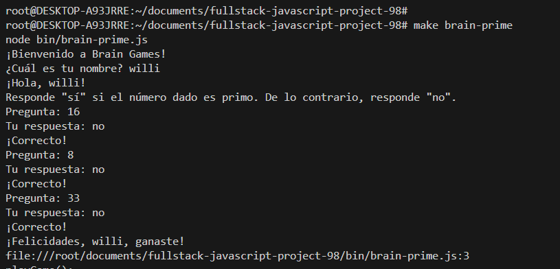
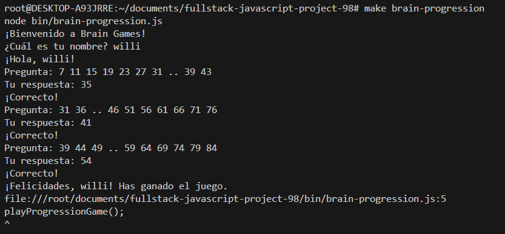

### Hexlet tests and linter status:
[](https://github.com/RSuarezwilli/fullstack-javascript-project-98/actions)

# Brain Even Game

Este es un juego donde tienes que adivinar si un número es par o impar.

## Instalación y Ejecución

Para instalar el paquete, ejecuta:

```bash
npm install

# Brain Calc

Este es un juego de matemáticas simple donde tienes que resolver sumas aleatorias.





